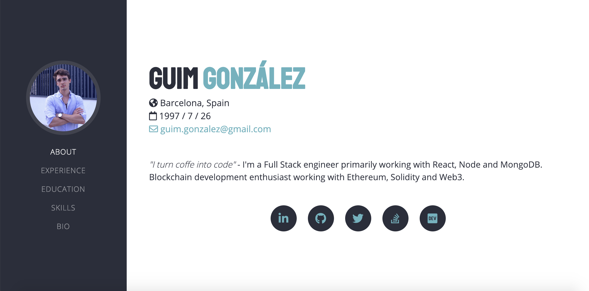

# Developer portfolio template [](https://twitter.com/intent/tweet?text=Create%20your%20own%20developer%20portfolio%20with%20this%20amazing%20template%20on%20Github&url=https://github.com/GuimG/dev-portfolio/&via=GuimGonzalez&hashtags=html,bootsrap,templates,css,developers,javascript)

Welcome to my developer portfolio template with HTML, CSS and JS 🚀 🚀 🚀. Free to use and easy to customize.  
Here you have a snapshot of how it looks like.



This is a template made for developers to use it as a landing page 💻. To see the live demo visit [guimg.github.io/dev-portfolio/](https://guimg.github.io/dev-portfolio/s).

## Usage

This template is fully customazible. To change your profile info, go to: `data/data.js`.
Within the file you'll find a Javascript object which contains all the profile data. Change the fields to your current one and once it's done, 💥 boom, refresh 🔁 the page and 👁 see the magic.

### Example

This is a reduced version of the profile object:

```javascript
var profile = {
  name: "Guim González",
  position: "Blockchain and FullStack developer",
  email: "guim.gonzalez@gmail.com",
  location: "Barcelona, Spain",
  birth: "1997-07-26"
};
```

Let's change the profile information to `John's Doe`:

```javascript
// My new profile
var profile = {
  name: "John Doe",
  position: "Web developer and cake lover",
  email: "john.doe@example.com",
  location: "San Francisco, CA",
  birth: "1989-09-06"
};
```

Done ✅ the new profile is ready. Try yours! 🔥

### Changing color

Don't like the color? 👨‍🎨 Try changing to new themes, here you have a list of them:

- Nightsky
- Sunset
- Purpledream
- Cutekitty

```javascript
let page = {
  theme: "nightsky"
  // ^ themes suported:
  //  - nightsky (default)
  //  - sunset
  //  - purpledream
  //  - cutekitty
};
```

> In this first version you can't change the language yet. Soon I'll commit new updates.

## Upload your page

Once you've forked, cloned or downloaded this repository, you can host your site on Github with [github pages](https://pages.github.com/). Once it's done, you can commit changes to the repo and they'll be automaticaly changed in your page. Or you can buy your own hosting if you want to.

## Troubleshooting and help

For any problem ❗️ or question ❓ of usage [send me an email](mailto:guim.gonzalez@gmail.com) ✉️.
Also, if you want any improvement on the page, feel free to write me. I'm open to all suggestions.

## Bugs and issues

For bugs 🐛 or issues ⚠️ with the template, please [open a new issue](https://github.com/GuimG/dev-portfolio/issues) here on Github.

## License

This code is under the [MIT License](https://opensource.org/licenses/MIT) which you can find in the [master branch](https://github.com/GuimG/dev-portfolio/blob/master/LICENSE).
